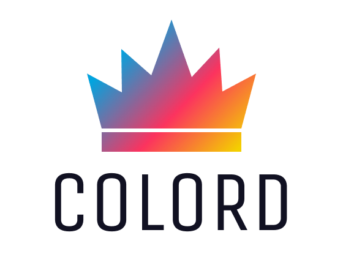

<div align="center">
  <a href="https://github.com/omgovich/colord">
    
  </a>
</div>

<div align="center">
  <a href="https://npmjs.org/package/colord">
    
  </a>
  <a href="https://github.com/omgovich/colord/actions">
    
  </a>
  <a href="https://codecov.io/gh/omgovich/colord">
    
  </a>
  <a href="https://npmjs.org/package/colord">
    
  </a>
  <a href="https://npmjs.org/package/colord">
    
  </a>
</div>

<div align="center">
  <strong>Colord</strong> is a tiny fast color manipulation and conversion tool
</div>

## Features

- 📦 **Small**: Just **1.5 KB** gzipped ([3+ times lighter](#benchmarks) than **color** and **tinycolor**)
- 🚀 **Fast**: [~50% faster](#benchmarks) than **color** and **tinycolor**
- 😍 **Simple**: Chainable API and familiar patterns
- 💪 **Immutable**: No need to worry about data mutations
- 🛡 **Bulletproof**: Written in strict TypeScript and 100% covered by tests
- 🗂 **Typed**: All types are available out of the box
- 🏗 **Extendable**: Built-in plugin system to add new functionality
- 👫 **Works everywhere**: Supports all browsers and Node 12+
- 💨 **Dependency-free**

## Benchmarks

| Library                       | <nobr>Operations/sec</nobr>   | Size                                                                                                                 | Size (gzip)                                                                                                             | Dependencies                                                                                                                      |
| ----------------------------- | ----------------------------- | -------------------------------------------------------------------------------------------------------------------- | ----------------------------------------------------------------------------------------------------------------------- | --------------------------------------------------------------------------------------------------------------------------------- |
| <nobr><b>colord 👑</b></nobr> | <nobr><b>1 692 690</b></nobr> | [](https://bundlephobia.com/result?p=colord)      | [](https://bundlephobia.com/result?p=colord)      | [](https://bundlephobia.com/result?p=colord)      |
| tinycolor2                    | 998 946                       | [](https://bundlephobia.com/result?p=tinycolor2) | [](https://bundlephobia.com/result?p=tinycolor2) | [](https://bundlephobia.com/result?p=tinycolor2) |
| color                         | 736 610                       | [](https://bundlephobia.com/result?p=color)           | [](https://bundlephobia.com/result?p=color)           | [](https://bundlephobia.com/result?p=color)           |

Performance results were generated on a MBP 2019, 2,6 GHz Intel Core i7. To perform these tests, execute `npm run benchmark` in the library folder.

## Getting Started

```
npm i colord
```

```js
import { colord } from "colord";

colord("#ff0000").grayscale().alpha(0.25).toRgbaString(); // "rgba(128, 128, 128, 0.25)"
colord("rgb(192, 192, 192)").isLight(); // true
colord("hsl(0, 50%, 50%)").darken(0.25).toHex(); // "#602020"
```

## API

### Color parsing

#### Accepted input formats:

- Hexadecimal strings
- RGB(A) strings and objects
- HSL(A) strings and objects
- HSV(A) objects
- Color names (via plugin)

```js
// String input examples
colord("#ffffff");
colord("rgb(255, 255, 255)");
colord("rgba(255, 255, 255, 1)");
colord("hsl(0, 100%, 100%)");
colord("hsla(0, 100%, 100%, 1)");

// Object input examples
colord({ r: 255, g: 255, b: 255 });
colord({ r: 255, g: 255, b: 255, a: 1 });
colord({ h: 360, s: 100, l: 100 });
colord({ h: 360, s: 100, l: 100, a: 1 });
colord({ h: 360, s: 100, v: 100 });
colord({ h: 360, s: 100, v: 100, a: 1 });
```

#### 🐕 Permissive parser

The library's parser trims unnecessary whitespaces, clamps numbers, disregards character case, punctuation, brackets, etc.

```js
colord(" aBc ").toHex(); // "#aabbcc"
colord("__rGbA 10 20,  999...").toRgbaString(); // "rgba(10, 20, 255, 1)"
colord(" hsL(  10, 200% 30 .5!!!").toHslaString(); // "hsla(10, 100%, 30%, 0.5)"
```

### Color conversion

| Method           | Result example                     |
| ---------------- | ---------------------------------- |
| `toHex()`        | `"#ffffff"`                        |
| `toRgba()`       | `{ r: 255, g: 255, b: 255, a: 1 }` |
| `toRgbaString()` | `"rgba(255, 255, 255, 1)"`         |
| `toHsla()`       | `{ h: 360, s: 100, l: 100, a: 1 }` |
| `toHslaString()` | `hsla(360, 100%, 100%, 1)`         |
| `toHsva()`       | `{ h: 360, s: 100, v: 100, a: 1 }` |

### Color manipulation

## Roadmap

- [x] Parse and convert Hex, RGB(A), HSL(A), HSV(A)
- [x] Saturate, desaturate, grayscale
- [x] Trim an input value
- [x] Clamp input numbers to resolve edge cases (e.g. `rgb(256, -1, 999, 2)`)
- [x] `brightness`, `isDark`, `isLight`
- [x] Set and get `alpha`
- [x] Plugin API
- [x] 4 and 8 digit Hex
- [x] `lighten`, `darken`
- [x] `invert`
- [x] CSS color names (via plugin)
- [ ] A11y and contrast utils (via plugin)
