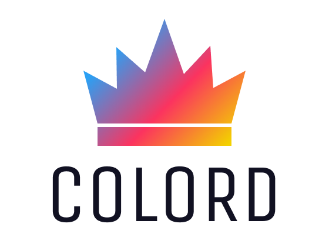

<div align="center">
  <a href="https://github.com/omgovich/colord">
    
  </a>
</div>

<div align="center">
  <a href="https://npmjs.org/package/colord">
    
  </a>
  <a href="https://github.com/omgovich/colord/actions">
    
  </a>
  <a href="https://codecov.io/gh/omgovich/colord">
    
  </a>
  <a href="https://npmjs.org/package/colord">
    
  </a>
  <a href="https://npmjs.org/package/colord">
    
  </a>
</div>

<div align="center">
  <strong>Colord</strong> is a tiny yet powerful tool for high-performance color manipulations and conversions.
</div>

## Features

- 📦 **Small**: Just **1.4 KB** gzipped ([3+ times lighter](#benchmarks) than **color** and **tinycolor2**)
- 🚀 **Fast**: [2+ times faster](#benchmarks) than **color** and **tinycolor2**
- 😍 **Simple**: Chainable API and familiar patterns
- 💪 **Immutable**: No need to worry about data mutations
- 🛡 **Bulletproof**: Written in strict TypeScript and 100% covered by tests
- 🗂 **Typed**: All [types are available](#types) out of the box
- 🏗 **Extendable**: Built-in [plugin system](#plugins) to add new functionality
- 👫 **Works everywhere**: Supports all browsers and Node 12+
- 💨 **Dependency-free**

<div></div>

## Benchmarks

| Library                       | <nobr>Operations/sec</nobr>   | Size                                                                                                                  | Size (gzip)                                                                                                              | Dependencies                                                                                                                         | Types                                                                                                            |
| ----------------------------- | ----------------------------- | --------------------------------------------------------------------------------------------------------------------- | ------------------------------------------------------------------------------------------------------------------------ | ------------------------------------------------------------------------------------------------------------------------------------ | ---------------------------------------------------------------------------------------------------------------- |
| <nobr><b>colord 👑</b></nobr> | <nobr><b>2 274 420</b></nobr> | [](https://bundlephobia.com/result?p=colord)       | [](https://bundlephobia.com/result?p=colord)       | [](https://bundlephobia.com/result?p=colord)         | [](https://bundlephobia.com/result?p=colord)         |
| color                         | 717 048                       | [](https://bundlephobia.com/result?p=color)            | [](https://bundlephobia.com/result?p=color)            | [](https://bundlephobia.com/result?p=color)              | [](https://bundlephobia.com/result?p=color)           |
| tinycolor2                    | 956 285                       | [](https://bundlephobia.com/result?p=tinycolor2)  | [](https://bundlephobia.com/result?p=tinycolor2)  | [](https://bundlephobia.com/result?p=tinycolor2) | [](https://bundlephobia.com/result?p=tinycolor2) |
| ac-colors                     | 637 469                       | [](https://bundlephobia.com/result?p=ac-colors) | [](https://bundlephobia.com/result?p=ac-colors) | [](https://bundlephobia.com/result?p=ac-colors)   | [](https://bundlephobia.com/result?p=ac-colors)      |
| chroma-js                     | 900 826                       | [](https://bundlephobia.com/result?p=chroma-js)    | [](https://bundlephobia.com/result?p=chroma-js)    | [](https://bundlephobia.com/result?p=chroma-js)      | [](https://bundlephobia.com/result?p=chroma-js)   |

The performance results were generated on a MBP 2019, 2,6 GHz Intel Core i7 via running `npm run benchmark` in the library folder. See [tests/benchmark.ts](https://github.com/omgovich/colord/blob/master/tests/benchmark.ts).

<div></div>

## Getting Started

```
npm i colord
```

```js
import { colord } from "colord";

colord("#ff0000").grayscale().alpha(0.25).toRgbaString(); // "rgba(128, 128, 128, 0.25)"
colord("rgb(192, 192, 192)").isLight(); // true
colord("hsl(0, 50%, 50%)").darken(0.25).toHex(); // "#602020"
```

<div></div>

## API

### Color parsing

#### Accepted input formats

- Hexadecimal strings (including 3, 4 and 8 digit notations)
- RGB(A) strings and objects
- HSL(A) strings and objects
- HSV(A) objects
- Color names ([via plugin](#css-color-names))
- LCH (coming soon)

```js
// String input examples
colord("FFF");
colord("#ffffff");
colord("#ffffffff");
colord("rgb(255, 255, 255)");
colord("rgba(255, 255, 255, 1)");
colord("hsl(0, 100%, 100%)");
colord("hsla(0, 100%, 100%, 1)");

// Object input examples
colord({ r: 255, g: 255, b: 255 });
colord({ r: 255, g: 255, b: 255, a: 1 });
colord({ h: 360, s: 100, l: 100 });
colord({ h: 360, s: 100, l: 100, a: 1 });
colord({ h: 360, s: 100, v: 100 });
colord({ h: 360, s: 100, v: 100, a: 1 });
```

#### Permissive parser

The library's parser trims unnecessary whitespaces, clamps numbers, disregards character case, punctuation, brackets, etc.

```js
colord(" aBc ").toHex(); // "#aabbcc"
colord("__rGbA 10 20,  999...").toRgbaString(); // "rgba(10, 20, 255, 1)"
colord(" hsL(  10, 200% 30 .5!!!").toHslaString(); // "hsla(10, 100%, 30%, 0.5)"
```

### Color conversion

| Method           | Result example                     |
| ---------------- | ---------------------------------- |
| `toHex()`        | `"#ffffff"`                        |
| `toRgba()`       | `{ r: 255, g: 255, b: 255, a: 1 }` |
| `toRgbaString()` | `"rgba(255, 255, 255, 1)"`         |
| `toHsla()`       | `{ h: 360, s: 100, l: 100, a: 1 }` |
| `toHslaString()` | `hsla(360, 100%, 100%, 1)`         |
| `toHsva()`       | `{ h: 360, s: 100, v: 100, a: 1 }` |

### Color manipulation

| Method                    | Note                    |
| ------------------------- | ----------------------- |
| `alpha(value)`            |                         |
| `invert()`                |                         |
| `saturate(ratio = 0.1)`   |                         |
| `desaturate(ratio = 0.1)` |                         |
| `grayscale()`             | Same as `desaturate(1)` |
| `lighten(ratio = 0.1)`    |                         |
| `darken(ratio = 0.1)`     |                         |

### Color analysis

| Method         | Result example | Note                                                                      |
| -------------- | -------------- | ------------------------------------------------------------------------- |
| `alpha()`      | `0.5`          |                                                                           |
| `brightness()` | `0.5`          | According to [WCAG algorithm](https://www.w3.org/TR/AERT/#color-contrast) |
| `isLight()`    | `false`        | Same as `brightness() >= 0.5`                                             |
| `isDark()`     | `true`         | Same as `brightness() < 0.5`                                              |

<div></div>

## Plugins

**Colord** has a built-in plugin system that allows new features and functionality to be easily added.

### CSS color names

Provides options to convert a color into a [CSS color keyword](https://developer.mozilla.org/en-US/docs/Web/CSS/color_value#color_keywords) and vice versa.

```js
import { colord, extend } from "colord";
import namesPlugin from "colord/plugins/names";

extend([namesPlugin]);

colord("tomato").toHex(); // "#ff6347"
colord("#00ffff").toName(); // "cyan"
colord("#aabbcc").toName(); // undefined (the color is not specified in CSS specs)
```

<div></div>

## Types

While not only typing its own functions and variables, **Colord** can also help you type yours. Depending on the color space you are using, you can also import and use the type that is associated with it.

```ts
import { RgbColor, RgbaColor, HslColor, HslaColor, HsvColor, HsvaColor } from "colord";

const foo: HslColor = { h: 0, s: 0, l: 0 };
const bar: RgbColor = { r: 0, g: 0, v: 0 }; // ERROR
```

<div></div>

## Roadmap

- [x] Parse and convert Hex, RGB(A), HSL(A), HSV(A)
- [x] Saturate, desaturate, grayscale
- [x] Trim an input value
- [x] Clamp input numbers to resolve edge cases (e.g. `rgb(256, -1, 999, 2)`)
- [x] `brightness`, `isDark`, `isLight`
- [x] Set and get `alpha`
- [x] Plugin API
- [x] 4 and 8 digit Hex
- [x] `lighten`, `darken`
- [x] `invert`
- [x] CSS color names (via plugin)
- [ ] 🚧 Mix colors (via plugin)
- [ ] A11y and contrast utils (via plugin)
- [ ] CMYK color space (via plugin)
- [ ] XYZ color space (via plugin)
- [ ] [LAB](https://www.w3.org/TR/css-color-4/#resolving-lab-lch-values) color space (via plugin)
- [ ] [LCH](https://lea.verou.me/2020/04/lch-colors-in-css-what-why-and-how/) color space (via plugin)
